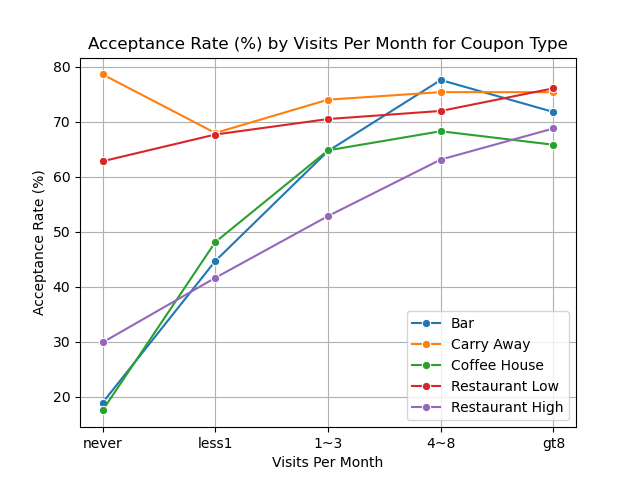

## Repository: UCB_Required_Assignment5_1
### Assignment: UCB AI/ML Course Required Assignment 5.1
### Author: Bart Rothwell
### Date: 10/15/2025

This README file summarizes the findings of an analysis of the program designed to deliver coupons to drivers for various establishments, based on driver attributes, and provides recommendations for the program implementation.

Link to Jupyter Notebook with the full analysis: https://github.com/bartrothwell/UCB_Required_Assignment5_1/blob/main/RequiredAssignment5_1_Rothwell.ipynb

#### Plot of Primary Findings:

#### Summary of Findings
- The primary finding from this analysis is summarized in the plot above, which shows that for bars, coffee houses, and expensive restaurants, the more often a driver frequents those types of establishments, the more likely they are to accept the coupon. However for takeout and less expensive restaurants (probably including fast food restaurants), drivers are accepting coupons just as often regardless of how often they visit such places.
- The analysis also shows that there are other driver attributes that affect coupon acceptance in some cases, such as age (with younger drivers being a little more likely to accept coupons to coffee houses) and whether the driver has a passenger who is not a kid, but other attributes such as income level and marital status don't seem to have a significant effect on coupon acceptance, at least in the case of coffee house coupons.
- Finally, there may be non-linear interactions between some of the individual attributes, but these may be rare (only one such case was found).
#### Recommendations
- Based on this analysis, I would definitely recommend moving foward with the program to offer coupons to drivers. Under the right conditions, coupon acceptance rates are in the 60% to 80% range, and while the acceptance of a coupon doesn't gaurantee a visit to the establishment, it will at least put the location on the driver's radar for a possible subsequent visit. Most encouraging is the fact that for takeout and fast food restaurants, drivers are accepting coupons even when they report rarely or never visiting those establishments.
- My specific recommendation for this program would be to focus on offering coupons based solely on the driver's reported frequency of visiting the type of establishment that the coupon is for, for bars, coffee houses, and expensive restaurants. For takeout and fast food restaurants, I would recommend offering the coupons to all drivers who have signed up for the program, given the high rates of acceptance of these coupons generally.
- I would not recommend tying the coupon offerings to any of the other driver attributes. While some of these attributes may influence coupon acceptance to a small degree, in some cases (for example, passenger status) using them to decide whether or not to present a coupon would require that the driver input that information for each trip. That seems burdensome and might turn the driver off to using the service. Other information such as income, marital status, and occupation might raise privacy issues with drivers. But asking a driver who signs up for the service how often they frequent certain types of establishment seems appropriate, and I believe that most drivers would be willing to provide that information.
